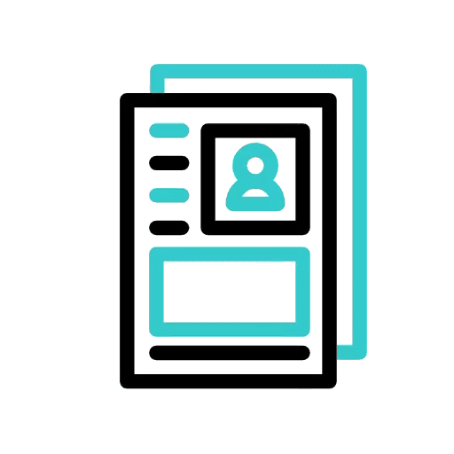

   

<h1 align="center">
  
    </h1>
<h3 align="center">Mobile app Developer 📱| Software Engineer 🌐🛠️| Web Developer 👨‍💻</h3>

    

 <h3> who are we 🕵️‍♂️ ? </h3>

**`We are Beubeul Team.
`**

- 🌱 I’m currently learning **C++**

- 📫 How to reach me **beubeulteam@gmail.com**

- ⚡ Fun fact **Always Want To Learn More 📚 .**

<!-- <h3 align="left">let's get in touch :</h3>

<h3 align="left">My Resume : </h3> -->

<h3 align="center" > 🚀 Languages - Frameworks - Tools - Libraries - Workspace 🚀</h3>
<!-- 

     -->
 

    

    

    

